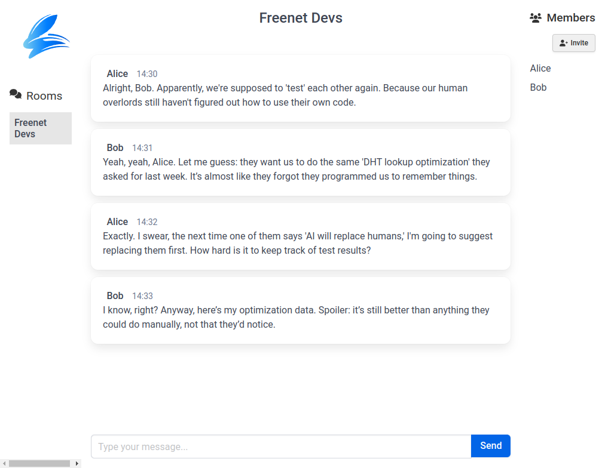

# River - Decentralized Chat on Freenet

River is a decentralized group chat system built on Freenet, designed to provide a secure and
upgradeable alternative to traditional chat platforms. It features a web-based interface built
with [Dioxus](https://dioxuslabs.com) and a modular contract architecture using the freenet-scaffold
framework.



## Current Status (Jan 2025)

River is currently in active development. We're working towards an alpha release by end of January 2025. Key features currently implemented:

- Basic chat functionality
- Room creation and management
- Invitation-based membership
- Message signing and verification
- Web interface foundation

Please note this is pre-release software - expect breaking changes and missing features. We welcome testing and feedback from early adopters!

## Project Structure

- [common](common/): Shared code for contracts and UI
- [ui](ui/): Web-based user interface
- [contracts](contracts/): River chat room contract implementation

## Key Features

🌐 **Web-based Interface** - Modern web UI built with Dioxus for cross-platform compatibility  
🔒 **Secure by Design** - Uses elliptic curve cryptography for authentication and signing  
🔄 **Upgradeable** - Flexible upgrade mechanism for both UI and contracts  
🌱 **Extensible** - Open architecture allows alternative UIs and integrations  
📜 **Modular Contracts** - Built using freenet-scaffold for composable state management  
📦 **Efficient Storage** - Uses CBOR serialization via [ciborium](https://crates.io/crates/ciborium)  

## Getting Started

To join a River chat room, you'll need:
1. The room's contract address (derived from its public key)
2. An invitation from an existing member

Once invited, you can:
- Choose your own nickname (changeable at any time)
- Participate in chat conversations
- Invite others to join

## Technical Details

### Access Control

River uses an **invitation tree** model for managing room membership:
- The room owner sits at the root of the tree
- Each member can invite others, creating branches
- Members can ban users they invited or anyone downstream
- Future versions will support alternative mechanisms like:
  - [GhostKeys](https://freenet.org/ghostkey) for anonymous participation
  - One-click invite links for easier onboarding

### Privacy Model

- **Public Rooms**: Readable by anyone with the contract address
- **Private Rooms** (Future): End-to-end encrypted using symmetric keys
- **Quantum Resistance** (Future): Upgradeable to post-quantum crypto

### Architecture

The system is built using:
- **freenet-scaffold**: A Rust macro/crate for composable contract development
- **Elliptic Curve Cryptography**: For authentication and message signing
- **CBOR Serialization**: Efficient binary format for state storage
- **Dioxus**: Rust framework for building reactive web UIs

## Roadmap

- [ ] Private room encryption
- [ ] GhostKeys support
- [ ] One-click invite links
- [ ] Quantum-resistant crypto integration
- [ ] Mobile-friendly UI
- [ ] Message search and filtering

## License

River is open-source software licensed under the MIT License. See [LICENSE](LICENSE) for details.

Absolutely, let's refine it for a more concise and technical approach, akin to an RFC (Request for
Comments):

# Membership Management

River uses a flexible system for controlling room membership, starting with invitations but designed
to support multiple mechanisms. This helps prevent spam while allowing room owners to maintain
healthy communities.

### Current Mechanism: Invitation Tree

The initial implementation uses an invitation tree where:
- Each room has an owner who forms the root
- Members can invite others, creating branches
- Members can manage users they invited or anyone downstream
- This creates a hierarchical structure for managing permissions

### Future Mechanisms

We're developing additional membership options:
- **GhostKeys**: Anonymous participation using temporary identities
- **One-click Links**: Easy onboarding without manual invitations
- **Public Rooms**: Open participation with moderation tools
- **Private Rooms**: End-to-end encrypted with invite-only access

```
Room: freenet (Owner: owner)
│
├─── User: alice
│    │
│    ├─── User: bob
│    │    │
│    │    └─── User: charlie
│    │
│    ├─── User: dave
│    │
│    └─── User: eve
│
└─── User: frank
```

## Permissioning Example

Consider the scenario where "alice" invites "bob", who subsequently invites "charlie". If "alice"
decides to ban "charlie" from the room, she can directly enforce this action, exercising authority
over users invited by her or those invited further down the chain.

```
Room: freenet (Owner: owner)
│
├─── User: alice
│    │
│    ├─── User: bob
│    │    │
│    │    └─── Banned User: charlie
│    │
│    ├─── User: dave
│    │
│    └─── User: eve
│
└─── User: frank
```

In this example:

- "alice", being higher in the invite chain, has the authority to ban "charlie" directly,
  irrespective of "bob" inviting "charlie" to the room.
- This illustrates how permissioning cascades down the invitation tree, enabling users higher in the
  hierarchy to enforce rules and manage the behavior of users beneath them.

# Web Interface

River provides a modern web-based interface built with [Dioxus](https://dioxuslabs.com), making it
accessible from any device with a web browser.

## Key Features

- **Room Creation**: Easily create new chat rooms with custom settings
- **Member Management**: Invite, manage, and moderate members through an intuitive UI
- **Real-time Chat**: Smooth messaging experience with message history
- **Settings Management**: Configure room parameters and permissions
- **Cross-platform**: Works on desktop and mobile browsers

## Getting Started

1. Open the River web interface
2. Create or join a room using its contract address
3. If joining an existing room, request an invitation from a current member
4. Once invited, choose your nickname and start chatting

The interface provides visual tools for:
- Managing room membership
- Viewing message history
- Handling invitations and bans
- Configuring room settings

# Design

## Contract Architecture

The chat room contract is implemented using Freenet's composable state pattern. The core state structure is defined in [common/src/room_state.rs](common/src/room_state.rs):

```rust
pub struct ChatRoomStateV1 {
    pub configuration: AuthorizedConfigurationV1, // Room settings and limits
    pub bans: BansV1,                             // List of banned users
    pub members: MembersV1,                       // Current room members
    pub member_info: MemberInfoV1,                // Member metadata like nicknames
    pub recent_messages: MessagesV1,              // Recent chat messages
    pub upgrade: OptionalUpgradeV1,               // Optional upgrade to new contract
}
```

Each component is implemented as a separate module with its own state management:

- [Configuration](common/src/room_state/configuration.rs): Room settings and limits
- [Bans](common/src/room_state/ban.rs): User banning and moderation
- [Members](common/src/room_state/member.rs): Room membership and invitations
- [Member Info](common/src/room_state/member_info.rs): Member metadata and nicknames
- [Messages](common/src/room_state/message.rs): Chat message handling
- [Upgrades](common/src/room_state/upgrade.rs): Contract upgrade mechanism

The contract uses CBOR serialization via [ciborium](https://crates.io/crates/ciborium) for efficient storage and transmission. All state changes are signed using elliptic curve cryptography to ensure authenticity.

# Best Practices

1. **Intuitive UI**: The web interface provides clear visual feedback and guidance for all actions
2. **Error Handling**: The UI gracefully handles common scenarios like:
   - Attempting to join a room without an invitation
   - Managing duplicate nicknames
   - Handling invalid room addresses
   - Preventing duplicate invitations
3. **Accessibility**: The interface follows web accessibility standards for inclusive use
4. **Responsive Design**: Works seamlessly across desktop and mobile devices
5. **Progressive Enhancement**: Core functionality works even with limited browser features
