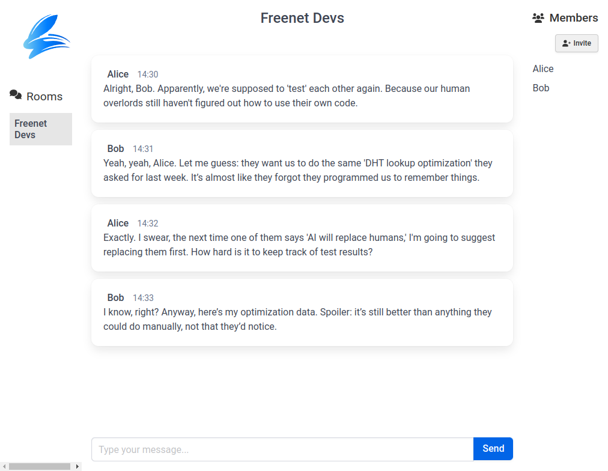

# Project README



## Try it out

### Prerequisites

#### Install Rust if you don't already have it

```bash
# On macOS and Linux
curl https://sh.rustup.rs -sSf | sh
```

#### Install the Dioxus CLI

```bash
cargo install dioxus
```

### Clone the River repository

```bash
git clone git@github.com:freenet/river.git
```

### Start the Dioxus dev server

```bash
cd river/ui
dx serve
```

Open the browser to http://localhost:8080.

## Project Structure

- [common](common/): Common code shared by contracts, delegates and UI
- [ui](ui/): User interface, built with [Dioxus](https://dioxuslabs.com)
