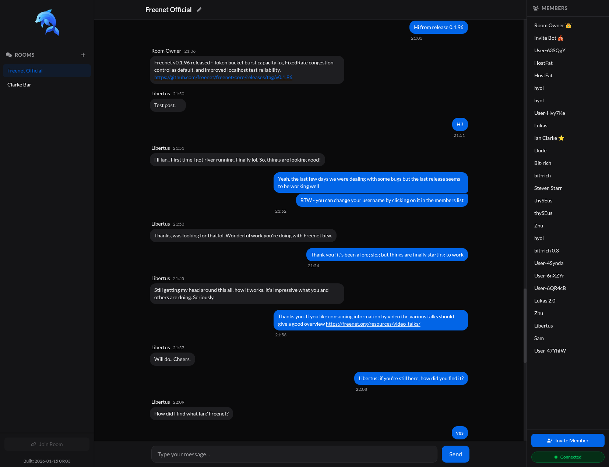

# River: group chat with no backend

River is a group chat app whose backend is a global peer-to-peer network instead of cloud servers.
Nobody runs a server for River, and nobody self-hosts: every room lives on Freenet, a network
made up of the computers of the people who run it. Because the network
caches and serves each room from nodes near whoever's asking, a busy room gets *more* capacity as it
gets more popular, the opposite of the server model where traffic is a bill someone has to pay.



## Contents

- [Wait, no backend?](#wait-no-backend)
- [How it works](#how-it-works)
- [Why not Matrix, Discord, or Signal?](#why-not-matrix-discord-or-signal)
- [What you can do today](#what-you-can-do-today)
- [Getting Started](#getting-started)
- [Command-line client (optional)](#command-line-client-optional)
- [Building from source](#building-from-source)
- [Access Control](#access-control)
- [Privacy Model](#privacy-model)
- [Architecture](#architecture)
- [License](#license)

## Wait, no backend?

Most apps you use are shaped like this:

```
your browser  ──▶  servers you operate  ──▶  a database you operate
```

River is shaped like this:

```
your browser  ──▶  Freenet, a global peer-to-peer network
                   (that nobody operates for River)
```

There is no backend behind River that anyone runs or pays for. River is the chat app, but the thing
it demonstrates is bigger: an application built this way doesn't need a backend at all. You install
Freenet once, and any number of apps can run on it the same way.

River is decentralized in the original sense of the word: no servers, no company, and no blockchain,
token, or coins anywhere. It is just code running on a shared network.

## How it works

On Freenet, the unit of deployment is a *contract*: a small piece of WebAssembly that defines what
valid state looks like and how it is allowed to change. A River room is one such contract. Its state
(members, messages, bans, encryption keys) lives on the network, replicated across the nodes that
care about it, and every change is cryptographically signed so any node can verify it without
trusting anyone.

That design has a few consequences worth calling out:

- **A room outlives its creator's session.** It stays available on the network whether or not the
  person who made it is online.
- **Popularity adds capacity.** A room in demand is cached on more nodes, so it gets faster and more
  resilient as it grows, not slower.
- **State is self-validating.** Because every message and membership change carries its own
  signature, anyone can host or migrate a room's data without being able to forge it.

Global scalability is the property Freenet is designed around, using small-world routing so any
node can locate any contract in a logarithmic number of hops. River inherits it for free.

## Why not Matrix, Discord, or Signal?

Those systems decentralize to different degrees, but each keeps servers somewhere:

- **Discord, Slack, Signal:** central servers operated by a company.
- **Matrix:** federated homeservers, each one run by someone.
- **Nostr:** relays, which are servers.
- **Briar, Tox:** genuinely serverless, but device-to-device, so both parties have to be online and
  there is no persistent shared room hosted by the network.

River keeps each room as state hosted by the Freenet network itself: no company server, no
homeserver to choose or operate, and rooms that persist when their creator is offline.

## What you can do today

- ✅ Real-time group chat
- ✅ Public rooms and private rooms (end-to-end encrypted)
- ✅ One-click invite links
- ✅ Invitation-tree moderation (manage or ban anyone you invited, or anyone downstream)
- ✅ Runs in the browser, on desktop and mobile
- ✅ Scriptable from the command line with `riverctl` (useful for bots and AI agents)
- 🚧 Message search and filtering
- 🚧 [GhostKey](https://freenet.org/ghostkey)-based anonymous joins

## Getting Started

The only thing you need to use River is Freenet. There is no River server to sign up for and no
account to create.

1. Install Freenet by following the [quickstart guide](https://freenet.org/quickstart/).
2. Click the invite link on that page to join the official River room.

River opens in your browser and works on both desktop and mobile. From there you can create your
own rooms and share their invite links; to join someone else's room you need an invitation from a
current member.

## Command-Line Client (optional)

`riverctl` is a command-line client for driving River rooms from a terminal or script, handy for
automation, bots, and AI agents. It is an alternative to the browser UI, not a requirement for
using River.

It is a Rust crate, so install the [Rust toolchain](https://rustup.rs/) first, then:

```bash
cargo install riverctl
```

Commands include:
- `riverctl room` - Room management (create, list, info)
- `riverctl message` - Send and receive messages
- `riverctl member` - Member management
- `riverctl invite` - Create and accept invitations

Use `--format json` for machine-readable output. Run `riverctl --help` for full documentation.

## Building from Source

You only need this to hack on River itself; using River needs nothing but Freenet (above). To build
and run the UI locally:

1. Install dependencies:

   ```bash
   # Install Rust using rustup
   curl --proto '=https' --tlsv1.2 -sSf https://sh.rustup.rs | sh

   # Add the wasm target
   rustup target add wasm32-unknown-unknown

   # Install ssl development library
   # This example is for Ubuntu and may be different on your system
   sudo apt-get install libssl-dev

   # Install Node.js (v20+) and npm
   # See https://nodejs.org/en/download for installation instructions.
   # Note: system packages (e.g. `apt-get install npm`) may ship outdated
   # versions that don't work. Install from the official site instead.

   # Install build tools
   cargo install dioxus-cli
   cargo install cargo-make
   ```

2. Build and run with example data:

   ```bash
   # Clone the repository
   git clone git@github.com:freenet/river.git

   # Enter the repository
   cd river

   # Initialize freenet submodule
   git submodule init
   git submodule update

   # Install Node.js dependencies (Tailwind CSS)
   cd ui && npm install && cd ..

   # Run development server with example data
   cargo make dev-example
   ```

3. Open http://localhost:8080 in your browser

The UI runs with example data and without syncing to Freenet, which is ideal for development. Two
feature flags control that behavior:

- **example-data**: populates the UI with sample rooms and messages
- **no-sync**: disables Freenet synchronization for local testing

They can be combined when building:

```bash
# Build with example data
cargo make build-ui-example

# Build without Freenet sync
cargo make build-ui-no-sync

# Build with both features
cargo make build-ui-example-no-sync
```

## Access Control

River manages room membership with an **invitation tree**:

- The room owner sits at the root.
- Any member can invite others, creating branches.
- A member can manage or ban anyone they invited, or anyone further down their branch.

```
Room: freenet (Owner: owner)
│
├─── User: alice
│    │
│    ├─── User: bob
│    │    │
│    │    └─── User: charlie
│    │
│    ├─── User: dave
│    │
│    └─── User: eve
│
└─── User: frank
```

For example, if alice invited bob, who then invited charlie, alice can ban charlie directly, because
charlie is downstream of her in the tree:

```
Room: freenet (Owner: owner)
│
├─── User: alice
│    │
│    ├─── User: bob
│    │    │
│    │    └─── Banned User: charlie
│    │
│    ├─── User: dave
│    │
│    └─── User: eve
│
└─── User: frank
```

Permissioning cascades down the tree: anyone higher in the chain has authority over those beneath
them. [GhostKey](https://freenet.org/ghostkey)-based anonymous joins are planned as an alternative
to invitation-only membership.

## Privacy Model

- **Public Rooms**: Readable by anyone with the contract address
- **Private Rooms**: End-to-end encrypted using symmetric AES-256-GCM keys
  - Room secrets distributed to members using ECIES (X25519 + AES-256-GCM)
  - Automatic secret rotation every 7 days
  - Rotation triggered when members are banned for forward secrecy
  - Manual rotation available to room owners
  - Encrypted room names, member nicknames, and messages

### What Private Rooms Hide, and What They Don't

Private rooms encrypt every message body, every member nickname, and
the room's name and description using a member-only AES-256-GCM
secret. Without that secret, none of that content is readable: not
by the network, not by Freenet nodes, not by anyone who happens to be
storing the contract. The secret is rotated weekly, immediately when
a member is banned, and on demand by the owner.

We use a shared room secret with scheduled rotation rather than a
per-message ratcheting scheme like Signal's double ratchet or MLS.
The shared-secret design fits Freenet's state-based contract model:
any member can decrypt the room's current state and history on demand
without needing to be online for every message, at the cost of the
finer-grained forward secrecy those protocols provide between
rotations.

What private rooms *don't* hide is metadata. Anyone who can read the
room's contract from the network can still observe:

- That the room exists, how many members it has, and the shape of the
  invitation and ban tree connecting them
- The size of each message and roughly when it was sent
- Overall activity volume and patterns

Each member is identified by a per-room key, not a global identity, so
those keys don't by themselves link a member to anything outside the
room. If your threat model requires unobservability, not just
confidentiality, River alone is not sufficient today.

## Architecture

### Project Structure

- [common](common/): Shared code for contracts and UI
- [ui](ui/): Web-based user interface, built with [Dioxus](https://dioxuslabs.com) and compiled to
  WebAssembly
- [contracts](contracts/): River chat room contract implementation

River is built with:

- **[freenet-scaffold](https://github.com/freenet/freenet-scaffold)**: a Rust macro/crate for
  composable contract development
- **Elliptic-curve cryptography**: for authentication and message signing
- **CBOR serialization** (via [ciborium](https://crates.io/crates/ciborium)): an efficient binary
  format for state storage
- **[Dioxus](https://dioxuslabs.com)**: a Rust framework for building reactive web UIs

### Contract State

The chat room contract uses Freenet's composable state pattern. The core state structure is defined
in [common/src/room_state.rs](common/src/room_state.rs):

```rust
pub struct ChatRoomStateV1 {
    pub configuration: AuthorizedConfigurationV1, // Room settings and privacy mode
    pub bans: BansV1,                             // List of banned users
    pub members: MembersV1,                       // Current room members
    pub member_info: MemberInfoV1,                // Member metadata like nicknames
    pub secrets: RoomSecretsV1,                   // Encrypted room secrets for private rooms
    pub recent_messages: MessagesV1,              // Recent chat messages
    pub upgrade: OptionalUpgradeV1,               // Optional upgrade to new contract
}
```

Each component is a separate module with its own state management:

- [Configuration](common/src/room_state/configuration.rs): Room settings, privacy mode, and display metadata
- [Bans](common/src/room_state/ban.rs): User banning and moderation
- [Members](common/src/room_state/member.rs): Room membership and invitations
- [Member Info](common/src/room_state/member_info.rs): Member metadata and nicknames
- [Secrets](common/src/room_state/secret.rs): Encrypted room secrets and key rotation for private rooms
- [Messages](common/src/room_state/message.rs): Chat message handling with encryption support
- [Privacy](common/src/room_state/privacy.rs): Encryption primitives and sealed data types
- [Upgrades](common/src/room_state/upgrade.rs): Contract upgrade mechanism

All state changes are signed using elliptic-curve cryptography. That is what makes a room's data
self-validating: any node can host or migrate it without being able to forge it.

## License

River is open-source software licensed under the LGPL License. See [LICENSE](LICENSE) for details.
